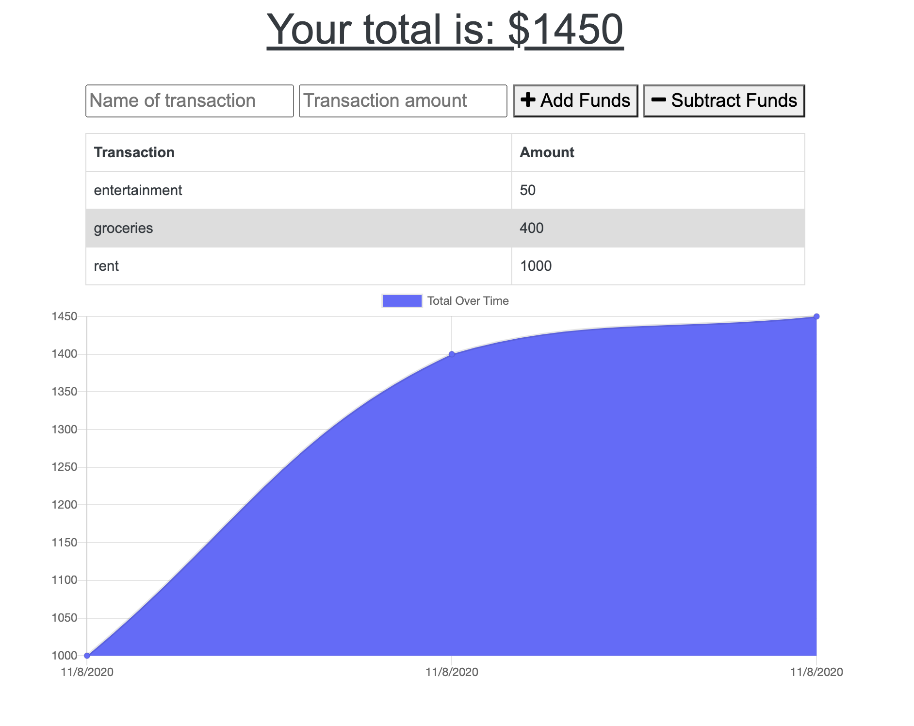

  
# Budget Tracker PWA

## Table of Contents
* [Description](#description)
* [Installation](#installation)
* [Usage](#usage)
* [License](#license)
* [Contributors](#contributors)
* [Questions](#questions)

## Description
This app is a money tracker that functions offline with PWA funtionality-- key functionality and assets are cached so that you do not need to be connected to the internet to use the app. Additionally, it has a feel of being more native to your mobile device than the browser, which allows for trust and user retention. 

## Installation Instructions
To install the app, one can clone the repository mentioned later in this readme.

## Usage Information
the command npm start opens the local session locally. Casual users of the app can head over to https://enigmatic-earth-32040.herokuapp.com/ and use it fully functionally without installing. 

## License
MIT

## Contributors
Caroline Twyman

## Questions
Contact me:

Github: [https://github.com/carolinetwyman](https://github.com/carolinetwyman)
Email: [carolinetwyman@github.com](carolinetwyman@github.com)
